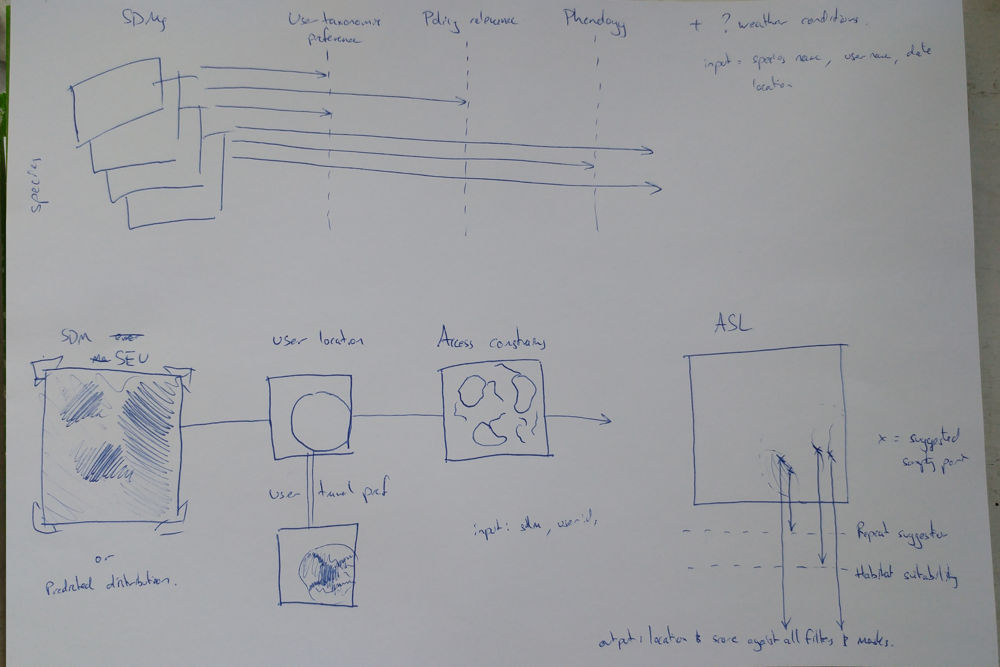

```{r setup, include=FALSE}
knitr::opts_chunk$set(echo = TRUE, cache = TRUE)
for(i in list.files('../scripts/modules/', full.names = TRUE)){ source(i) }
library(raster)
```

## Introduction

This document outlines the suggested workflow for creating the adaptive sampling surface that will support the digital engagements in WP3 of DECIDE

### Aims

- **The workflow should be moduler**

    The workflow will contain many steps, with different filters, weights and masks being applied. To make this managable each step should be isolated as a module (an R function)
  
- **The output should be interpretabale**

    Each module will have an effect on the adaptive sampling surface. The meaning, or reasoning, of this change must be captured in the output. For example if the adaptive sampling surface is restricted to sites within 10km, this should be defined in the metadata of the output. If a particular species is selected because the user has not recorded it before, this should be captured. This should make the life of people in 3.2 much easier 

- **All modules should be customisable**

    Modules will be parameterisable. This might be parameterised from past user data, or from user settings, either way as much parameterisation as possible should be retained as possible to allow future changes and a rich user expereince

- **The workflow should be well documented**

    Tom might get hit by a bus, so write manuals, even though nobody reads them

- **The final workflow should be deployable as an API**

    The ambition is to publish the workflow as an API, I think, we can use plumber for that

### Workflow

I have given some thought to the structure of this workflow. I think there are three stages, and within these a number of filters, which are our modules.



#### Species filtering

The first step is to consider which the species of interest are. Which species do we want _this_ user to look for in _this_ location. These modules may not all be used for all users, for example some users may not care about the policy relevance.

**1. Phenology**

Which species are available to be observed?

_Input_: Date; Species group (e.g. moths); Location

_Output_: Species list

_Metadata_: flight period of those species selected

**2. User species preference**

Which species does this user want to go and look for?

_Input_: UserID

_Output_: Species list (cached user preference, or drawn from previous data)

_Metadata_: User specied groups/species &/OR species previously recorded

**3. Policy relevance**

_Input_: Criterea (e.g. IUCN threatened / Priority species / ...); Location

_Output_: Species list

_Metadata_: Criterea used


#### Spatial filtering

In the second step we aplly the spatial filtering to our data. 

**4. Distance to user**

Weight/mask the adaptive sampling surface based on distance to a specific location (i.e. the user's current location)

_Input_: Sampling layer(s); Location; Method

_Output_: Masked/rescaled adaptive sampling layer

_Metadata_: Method used

**5. Accessible locations**

Identify accessible features (footpaths, parks, etc) within the area of interest

_Input_: Spatial layer of accessible locations [one or all of footpaths, parks, etc]; point location; buffer

_Output_: Spatial subset of accessible locations with their metadata

_Metadata_: Buffer size, spatial layer used

**6. Feature sampling**

From all potential places to visit, pick a sample

_Input_: Adaptive sampling layer; Spatial subset of accessible locations; selection algorithm (e.g. number to select, etc)

_Output_: Suggested locations to visit

_Metadata_: Algorithm used

#### Point filtering

Now that we have some suggested locations to visit, we have some additional filtering steps.

**7. Habitat suitability**

Is the feature a suitable habitat for the species, and what is the degree of uncertainty

_Input_: Suggested locations to visit [from 6]; Model;

_Output_: Suitability metrics for the suggested locations to visit

_Metadata_: Model details?

**8. Repeat records**
    
Are any of these suggestions that have been made to this user before?

_Input_: Suggested locations to visit; past recommendadtions to user; Time frame to consider

_Output_: Details for each location of their previous recommendations to the user

_Metadata_: Time frame used

## Dummy code

This is how I imagine the functions to work. The first set of functions generate species lists that are used to filter.

**1. Phenology**

```{r}
x <- filter_phenology(date = Sys.Date(),
                     taxa = 'butterflies',
                     lat_long = c(51.602436, -1.110557))
str(x)
```

**2. User species preference**

```{r}
x <- filter_user_preference(userID = 1)
str(x)
```

**3. Policy relevance**

```{r}
x <- filter_policy_relevance(criterea = 'iucn',
                             location = c(51.602436, -1.110557))
str(x)
```

**Load in some SDM ouput**

The next set of functions filter a spatial surface, so I'm going to load in one here.

```{r}
# load in an example raster
load('../data/sdm_output/example_05_11/Tyria jacobaeae_lr.rdata')

p <- (out$Predictions)
raster = p

# because raster is currently lat/long, convert it to BNG outside of function (for now)
crs(raster) <- CRS("+proj=longlat")
raster <- projectRaster(raster, crs = CRS("+init=epsg:27700"), method = 'ngb')
plot(raster)

# test the function
masked_area <- filter_distance(raster = raster,
                               location = c(-0.150693, 51.410548),
                               method = 'buffer',
                               distance = 20000)
# Review output
plot(masked_area)
#...
```

**4. Distance to user**

**5. Accessible locations**
